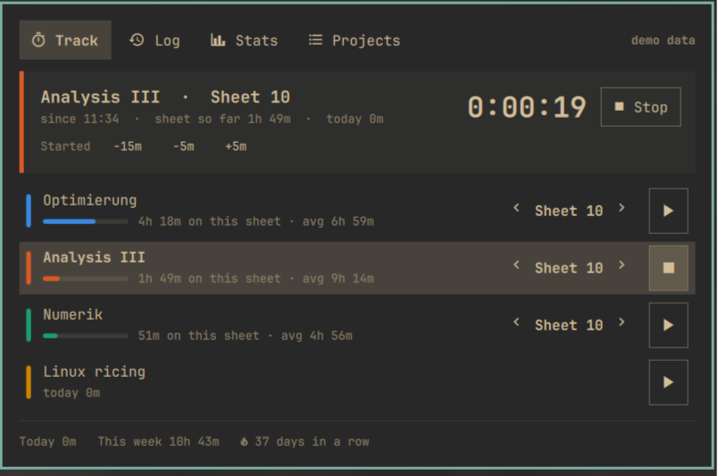
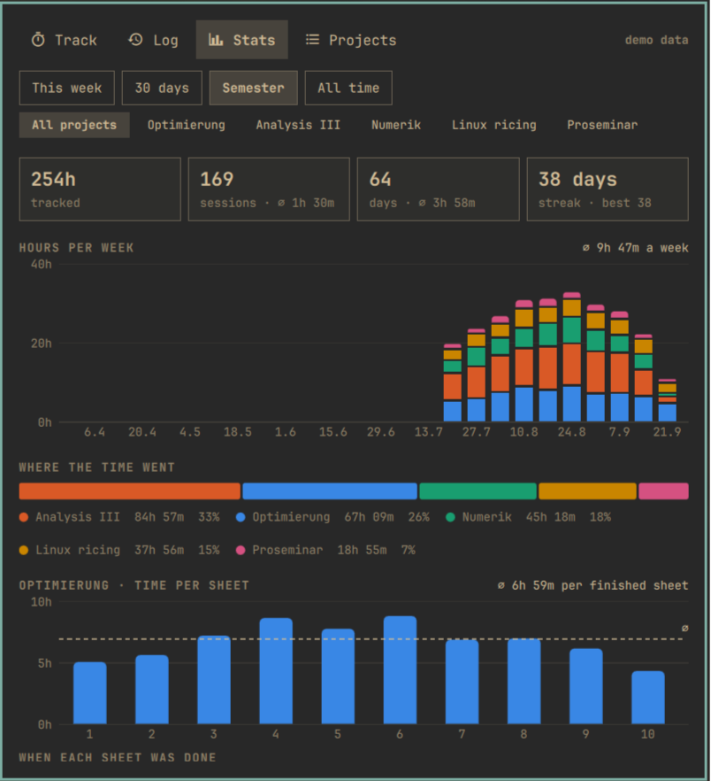
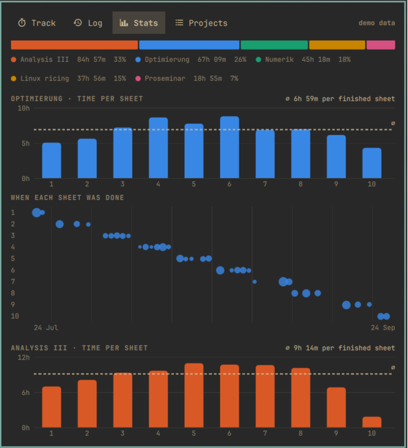
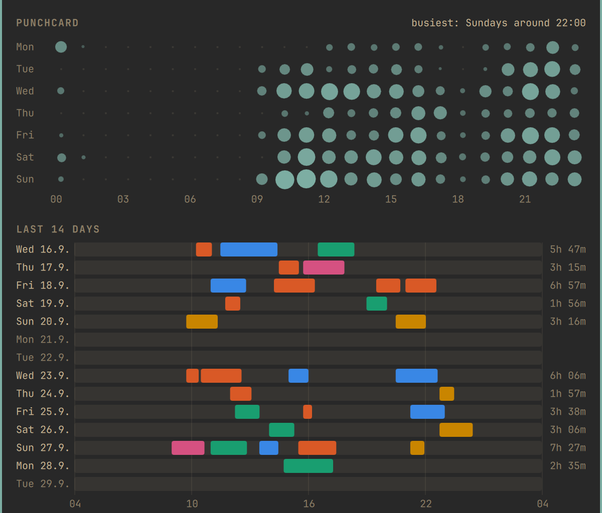

# Omarchy Time Tracker

A time tracker that lives in the [Omarchy](https://omarchy.org) bar. Built for
university courses with a weekly problem sheet, and for side projects that
just need a running total.

> **Fully vibe-coded.** Every line here, code, tests and this README, was
> written by an AI (Claude) from a plain-language description, and I have not
> reviewed it line by line. The data layer has unit tests, and the widget was
> clicked through on a real Omarchy desktop (start, stop, sheets, editing, a
> shell restart, simulated shutdown and suspend). Stopping on screen lock has
> not been tried with a real lock yet. It works on my machine; read it with
> that in mind.

- **One click** starts or stops a course; clicking another one switches.
- **Sheets:** courses count their problem sheets. `›` means "this sheet is
  done" and moves on to the next; `‹` goes back to catch up on an old one.
- **Stats:** hours per week, time per sheet against your average, when each
  sheet got done, a weekday × hour punchcard, a timeline of the last days, a
  calendar, and some fun facts.
- **Safety nets:** shutdown, suspend and screen lock stop the clock on their
  own. A shell restart does not.



| Overview | Sheets | Rhythm |
|---|---|---|
|  |  |  |

*(Screenshots show the built-in demo data.)*

## Install

Needs Omarchy 4 (the Quickshell-based `omarchy-shell`), nothing else.

```bash
omarchy plugin add https://github.com/flitscha/omarchy-time-tracker.git --enable
```

It lands on the right of the bar. To place it yourself:

```bash
omarchy bar move felix.time-tracker --before omarchy.tray
```

To work on it, clone it anywhere and run `./install.sh`, which links the
checkout into `~/.config/omarchy/plugins/felix.time-tracker` instead. After
changing QML, restart the shell - hot reload does not reliably pick up changes
to a `keepLoaded` service:

```bash
omarchy restart shell
```

### Remove

```bash
omarchy plugin remove felix.time-tracker
```

takes it off the bar and deletes the plugin. Your tracked time stays in
`~/.local/share/time-tracker/`; delete that folder too to remove everything.
(For a checkout linked with `install.sh`: `omarchy plugin disable
felix.time-tracker`, then remove the link in `~/.config/omarchy/plugins/`.)

### What it does on your machine

- Writes only to `~/.local/share/time-tracker/` (see [Data](#data)). Once a
  day a small shell command there copies `data.json` into `backups/` and
  deletes the backups beyond the newest 30 - the only thing it ever deletes.
- Reads Hyprland's monitor state every 5 s while a session runs, to notice
  a locked screen.
- No network access.

## Using it

| Where | What |
|---|---|
| bar, left click | open the popup |
| bar, right click | stop, or resume after an automatic stop |
| bar, middle click | restart the most recent project |
| popup, `1`–`4` / `Tab` | switch tabs; `Esc` closes |

**Track:** one row per visible project. The whole row is the start/stop
button. For sheet projects, the thin bar under the name compares the time on
the current sheet with the average of the earlier ones. While something runs,
`−15m` / `−5m` / `+5m` fix a start you forgot to press.

**Log:** every session by day. Click one to change its times, sheet or
project, or delete it. *Add a session* is for work you did not track.

**Stats:** filter by range (this week, 30 days, semester, all time) and by
project. Hover a chart to read the numbers in its header. "Semester" starts on
1 March or 1 October.

**Projects:** create, edit, reorder, hide. A new project is a plain counter;
switch it to *With sheets* for courses. Hiding (the eye) keeps all data and
takes the project off the track tab, which is the way to retire old courses.
Deleting removes its sessions too.

A day starts at 04:00 by default (Projects → Settings), so a session that runs
past midnight counts towards the evening it began in.

### From the command line

```bash
omarchy-shell timetracker status             # JSON: what is running
omarchy-shell timetracker toggle Optimierung # by name, short name or prefix
omarchy-shell timetracker start Opt
omarchy-shell timetracker stop
omarchy-shell timetracker resume           # or: dismiss
omarchy-shell timetracker next Optimierung   # sheet done
omarchy-shell timetracker previous Optimierung
omarchy-shell timetracker demo on            # made-up semester, nothing saved
omarchy-shell timetracker probe              # what the lock detection sees
omarchy-shell shell toggle felix.time-tracker # open/close the popup
```

These work in Hyprland bindings too, e.g. a key that stops the clock.

## How the safety nets work

The running session lives in `active.json`. The service rewrites that file
every 20 seconds together with the kernel's boot id (a *heartbeat*). Nothing
depends on a shutdown hook, because a shell that is killed at shutdown never
gets to run one.

| Event | Detected by | The session ends at |
|---|---|---|
| shutdown / reboot | on startup, the heartbeat is from another boot | the last heartbeat (≤ 20 s early) |
| shell crash, long gap | on startup, the heartbeat is older than 90 s | the last heartbeat |
| shell restart | on startup, the heartbeat is fresh | nothing: the clock keeps running |
| suspend | the 1 s timer notices a jump in wall-clock time | the last tick before sleep |
| screen lock | Hyprland reports `LOCK` in `solitaryBlockedBy` (polled every 5 s) | when the lock was seen |

After an automatic stop the bar icon blinks once the screen is unlocked. A
right click, or *Resume* in the popup, continues on the same sheet.

Sessions shorter than a minute are treated as misclicks and not saved.

## Data

`~/.local/share/time-tracker/` (or `$XDG_DATA_HOME/time-tracker`):

- `data.json`: projects and sessions, one per line, safe to read and diff
- `active.json`: the running session and its heartbeat
- `backups/data-YYYY-MM-DD.json`: the state before each day's first change;
  the last 30 are kept

If `data.json` cannot be parsed, the service does not overwrite it. The popup
shows "data.json unreadable" until the file is fixed or moved away.

## Development

```
Service.qml       the clock: state, files, heartbeat, lock/suspend, IPC
BarWidget.qml     bar pill and popup host
Popup.qml         tabs
views/            Track, Log, Stats, Projects, and the two editors
charts/           bars, punchcard, timeline, calendar, share bar, sheet timeline
Store.js          data model: parse, serialise, copy-on-write edits
Stats.js          aggregations for the stats tab
Palette.js        project colours
Demo.js           the demo semester
```

`Store.js`, `Stats.js` and `Demo.js` are plain QML JavaScript libraries. The
tests load them under node:

```bash
TZ=Europe/Vienna node --test tests/*.test.js
```

Project colours are eight fixed, colour-blind-checked hues with separate steps
for dark and light themes. The theme's own ANSI colours were too close to each
other (gruvbox green, aqua and yellow). Everything else follows the Omarchy
theme.
